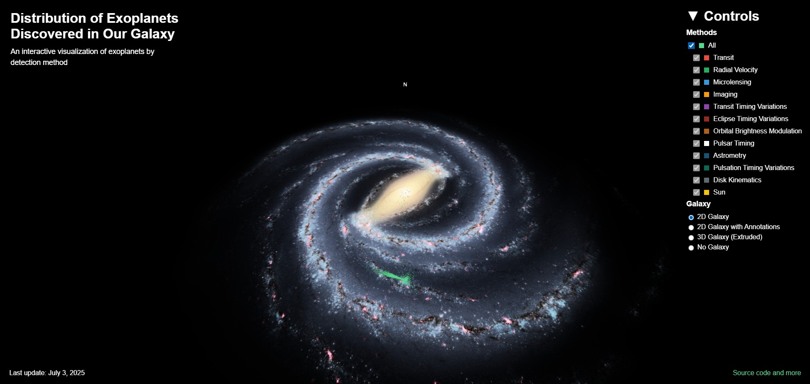
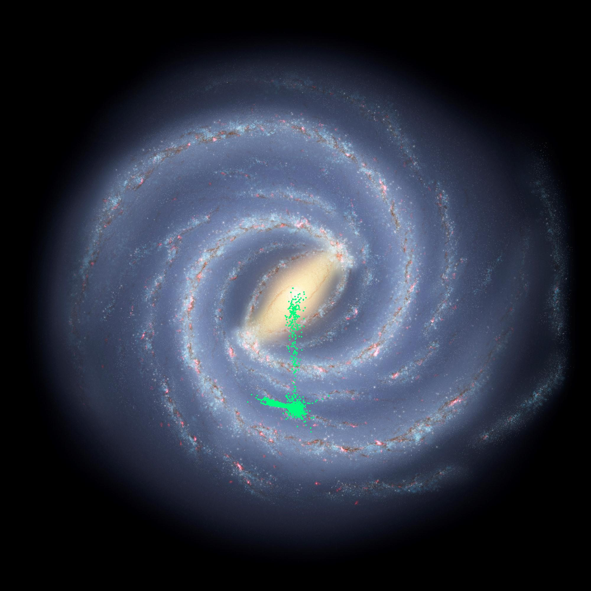
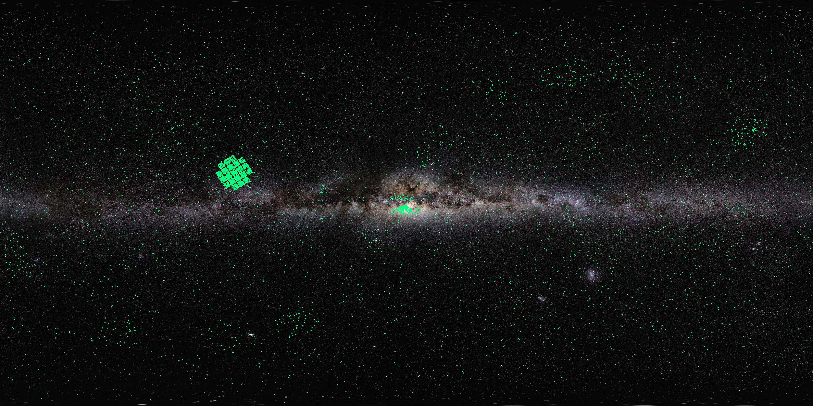

# Exoplanets in the Galaxy

## Overview
Thousands of exoplanets have been discovered, most of them not so far from the Sun considering the galactic scale. This distribution is mostly because the methods used for detection can more easily detect exoplanets close to us or exoplanets with certain characteristics, not because all exoplanets are really distributed close to us. Curious about what area of our Galaxy we were able to map for exoplanets, I made this interactive visualization. You may see that, until now, we just mapped a very small region of our Galaxy.

There have been <!--EXOPLANETS-->6042<!--EXOPLANETS--> exoplanets discovered around <!--STARS-->4507<!--STARS--> stars. But only <!--SDIST-->4481<!--SDIST--> of those stars have had their distance to us determined, totaling <!--PDIST-->6016<!--PDIST--> exoplanets in the visualization.

Access the interactive visualization in your browser going [here](https://ferdesmello.github.io/exoplanets-in-the-galaxy-3d/) or clicking on the image below.

Also, the files are being update monthly with the newly discovered exoplanets in the [exoplanet archive](https://exoplanetarchive.ipac.caltech.edu/). 

Date of the last (automatic) update: <!--LAST_UPDATE-->2025-11-01<!--END_LAST_UPDATE-->


[](https://ferdesmello.github.io/exoplanets-in-the-galaxy-3d)

## What the code does

### 1. Scraping the data
Run **exoplanet_data_from_API.py** to retrieve data from [https://exoplanetarchive.ipac.caltech.edu](https://exoplanetarchive.ipac.caltech.edu) and build (or update) _Exoplanets_coordinates.txt_ and _exoplanets_coordinates_methods.txt_ with distance, position, and method of detection of every exoplanet (with estimated distance to us) discovered till now.

### 2. Simple face-on and edge-on flat maps
Run **flat_galaxy_maps.py** to retrieve data from _exoplanets_coordinates.txt_ and _Artist's_impression_of_the_Milky_Way_gna_small.jpg_ to make _MW_fo_dots.jpg_, 2D map of the distribution of exaplanets discovered in our Galaxy.



It also retrieves data from _exoplanets_coordinates_l_b.txt_ and _Milky_Way_edge_on.jpg_ to make _MW_eo_dots.jpg_, another 2D map of the distribution of exaplanets discovered in our Galaxy.



### 3. From TXT to JSON
Run **TXT_to_JSON.py** to retrieve data from _exoplanets_coordinates.txt_ and _exoplanets_coordinates_methods.txt_ and transform the data to JSON format in _exoplanets_coordinates.json_ and _exoplanets_coordinates_methods.json_. This is used in the interactive visualization.

### 4. Semi-transparent PNGs
The images _MW_transparent.png_ and _MW_transparent_small.png_ may already be present. If not, you need to run **Exoplanets_in_the_Galaxy_3D.nb** ([Mathematica notebook](https://www.wolfram.com/notebooks/)) to create them and have a 3D visualization of the exoplanets.

### 5. Local visualization
Now, to access the interactive visualization _locally_ in your browser, you need to run **index.html** locally.

In your computer, open a terminal window and go to the project folder:
```console
cd C:\Git\exoplanets-in-the-galaxy-3d
```
Create a server:
```console
python -m http.server 8000
```
In your browser, go to:
```console
http://127.0.0.1:8000/
```
Later, close the server in the terminal pressing "Ctrl+C" in it.

## The Images of our Galaxy
The Illustration of our Galaxy comes from [here](https://www.eso.org/public/images/eso1339g/). The annotated version can be found [here](https://www.eso.org/public/images/eso1339e/). The edge on picture of our Galaxy comes from [here](https://www.eso.org/public/images/eso0932a/). The extruded galaxy is built from a low-resolution black-and-white (also in the folder _Images_) version of the illustration, where the height of the mesh is set in function of how bright a pixel is in the image.

## For exoplanet archive information in retrieving data, see:
#### Some documentation
[https://exoplanetarchive.ipac.caltech.edu/applications/DocSet/index.html?doctree=/docs/docmenu.xml&startdoc=item_1_01](https://exoplanetarchive.ipac.caltech.edu/applications/DocSet/index.html?doctree=/docs/docmenu.xml&startdoc=item_1_01)
#### How to use TAP and retrieve data
[https://exoplanetarchive.ipac.caltech.edu/docs/TAP/usingTAP.html](https://exoplanetarchive.ipac.caltech.edu/docs/TAP/usingTAP.html)
#### And how to choose your table and data on TAP
[https://exoplanetarchive.ipac.caltech.edu/docs/API_PS_columns.html](https://exoplanetarchive.ipac.caltech.edu/docs/API_PS_columns.html)
